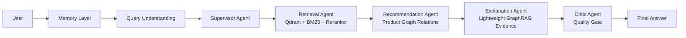

# AssistGen

<p align="center">
  
  
  
  
  
</p>

<p align="center">
  <b>[ <a href="./README.md">中文说明</a> | English ]</b>
</p>

**AssistGen** is a compact multi-agent ecommerce shopping assistant. It demonstrates an end-to-end agentic shopping guidance workflow: understanding user intent, retrieving grounded product facts, recommending related products through product-graph relations, explaining recommendations, managing multi-turn memory, and reviewing the final response with a Critic Agent.

It is built as a learning and portfolio project for Agent application development, with emphasis on clear architecture, observable execution, and practical ecommerce reasoning rather than a generic chatbot demo.

## Key Features

- **Multi-Agent Shopping Workflow**: Supervisor, Retrieval, Recommendation, Explanation, and Critic agents are organized around a real ecommerce guidance loop.
- **Hybrid Product RAG**: Combines Qdrant dense retrieval, BM25 sparse retrieval, metadata filtering, score fusion, and optional `gte-rerank-v2` reranking.
- **Graph-Based Recommendation**: Uses product relations such as `COMPLEMENTS`, `BOUGHT_WITH`, `UPGRADE`, `BUNDLE`, and `SUBSTITUTE` to generate deterministic add-on recommendations.
- **Lightweight GraphRAG Explanation**: Retrieves product-relation evidence and turns it into buyer-friendly explanations without letting the LLM invent products.
- **Memory & Context Management**: Maintains `session_id`, `shopping_state`, `effective_query`, per-agent memory views, and long-session compression.
- **Critic Quality Gate**: Checks factual grounding, budget constraints, recommendation timing, readability, and human tone before the final answer is returned.
- **Observable Agent Runtime**: Supports backend Agent Trace Console and frontend SSE stage streaming for learning, debugging, and demos.
- **Graceful Fallbacks**: Can continue with local CSV data and in-memory session storage when Qdrant, Redis, Neo4j, or external APIs are unavailable.

## Architecture



## Quick Start

```bash
git clone https://github.com/lgh88666/lgh88666-assistgen.git
cd lgh88666-assistgen
```

Backend:

```bash
cd backend/llm_backend
python -m venv .venv
.venv/Scripts/activate
pip install -r ../requirements.txt
copy .env.example .env
python run.py
```

Frontend:

```bash
cd frontend
npm install
npm run dev
```

## More Docs

- [Architecture](./docs/architecture.md)
- [Memory Design](./docs/v3_memory_architecture.md)
- [Draw.io Architecture Diagram](./docs/assistgen_architecture.drawio)

## License

AssistGen is released under the [MIT License](./LICENSE).
