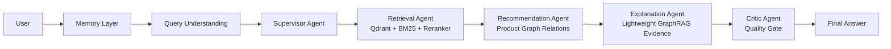

# AssistGen

<p align="center">
  
  
  
  
  
</p>

<p align="center">
  <b>[ English | <a href="#-中文说明">中文说明</a> ]</b>
</p>

**AssistGen** is a compact multi-agent ecommerce shopping assistant. It demonstrates an end-to-end agentic shopping guidance workflow: understanding user intent, retrieving grounded product facts, recommending related products through product-graph relations, explaining the recommendation, managing multi-turn memory, and reviewing the final response with a Critic Agent.

It is built as a learning and portfolio project for Agent application development, with emphasis on clear architecture, observable execution, and practical ecommerce reasoning rather than a generic chatbot demo.

## Key Features

- **Multi-Agent Shopping Workflow**: Supervisor, Retrieval, Recommendation, Explanation, and Critic agents are organized around a real ecommerce guidance loop.
- **Hybrid Product RAG**: Combines Qdrant dense retrieval, BM25 sparse retrieval, metadata filtering, score fusion, and optional `gte-rerank-v2` reranking.
- **Graph-Based Recommendation**: Uses product relations such as `COMPLEMENTS`, `BOUGHT_WITH`, `UPGRADE`, `BUNDLE`, and `SUBSTITUTE` to generate deterministic add-on recommendations.
- **Lightweight GraphRAG Explanation**: Retrieves product-relation evidence and turns it into buyer-friendly explanations without letting the LLM invent products.
- **Memory & Context Management**: Maintains `session_id`, `shopping_state`, `effective_query`, per-agent memory views, and long-session compression.
- **Critic Quality Gate**: Checks factual grounding, budget constraints, recommendation timing, readability, and human tone before the final answer is returned.
- **Observable Agent Runtime**: Supports backend Agent Trace Console and frontend SSE stage streaming for learning, debugging, and demos.
- **Graceful Fallbacks**: Can continue with local CSV data and in-memory session storage when Qdrant, Redis, Neo4j, or external APIs are unavailable.

## Architecture



## Tech Stack

| Area | Stack |
|---|---|
| Backend | Python, FastAPI, Pydantic |
| Agent Runtime | LangGraph-style multi-agent pipeline |
| Frontend | Vue 3, Vite, TypeScript, Pinia |
| Retrieval | Qdrant, BM25, optional external reranker |
| Recommendation | CSV product graph, optional Neo4j fallback |
| Memory | Redis with in-memory fallback |
| Models | DeepSeek-compatible chat API, DashScope `text-embedding-v4`, `gte-rerank-v2` |

## Quick Start

### 1. Clone

```bash
git clone https://github.com/lgh88666/lgh88666-assistgen.git
cd lgh88666-assistgen
```

### 2. Backend

Requires Python 3.10+.

```bash
cd backend/llm_backend
python -m venv .venv
.venv/Scripts/activate
pip install -r ../requirements.txt
copy .env.example .env
python run.py
```

Backend default URL:

```text
http://localhost:8000
```

Main Agent APIs:

```text
POST /api/agent/query
POST /api/agent/query/stream
```

### 3. Frontend

```bash
cd frontend
npm install
npm run dev
```

Frontend default URL:

```text
http://localhost:5173
```

### 4. Optional Qdrant Indexing

If Qdrant is running locally:

```bash
cd backend/llm_backend
python scripts/index_products_to_qdrant.py
python scripts/index_explanation_evidence_to_qdrant.py
```

If Qdrant is unavailable, AssistGen falls back to local retrieval paths where possible.

## Data Layout

AssistGen includes a simulated smart-home ecommerce dataset for demo and testing.

```text
backend/llm_backend/app/data/
├── products.csv              # product facts: price, stock, brand, category, tags
└── product_relations.csv     # product graph edges: complements, upgrades, bundles
```

## Environment Variables

Copy the example file and fill in private values locally:

```bash
cd backend/llm_backend
copy .env.example .env
```

Important variables:

| Variable | Description |
|---|---|
| `AGENT_SERVICE` | `deepseek` or `ollama` |
| `DEEPSEEK_API_KEY` | chat model API key |
| `DEEPSEEK_BASE_URL` | DeepSeek-compatible API base URL |
| `DEEPSEEK_MODEL` | chat model name |
| `EMBEDDING_PROVIDER` | `local` or `dashscope` |
| `EMBEDDING_MODEL` | default: `text-embedding-v4` |
| `EMBEDDING_API_KEY` | embedding API key when using DashScope |
| `RERANKER_PROVIDER` | set to `dashscope` to enable external reranking |
| `RERANKER_MODEL` | default: `gte-rerank-v2` |
| `QDRANT_URL` | Qdrant endpoint |
| `REDIS_HOST` / `REDIS_PORT` | optional session memory store |
| `AGENT_TRACE` | set `true` to print compact agent trace logs |

Never commit real API keys, database passwords, or local `.env` files.

## Repository Structure

```text
AssistGen/
├── backend/
│   ├── requirements.txt
│   └── llm_backend/
│       ├── app/
│       │   ├── api/
│       │   ├── core/
│       │   ├── data/
│       │   └── lg_agent/
│       ├── scripts/
│       └── run.py
├── frontend/
├── docs/
├── scripts/
├── docker-compose.yml
└── README.md
```

## Development Checks

```bash
cd backend/llm_backend
python -B test_memory_context.py
python -B test_critic_quality_gate.py

cd ../../frontend
npm run build
```

## Roadmap

- Expand the smart-home ecommerce demo dataset.
- Improve graph recommendation evaluation and counterexample tests.
- Strengthen memory compression and selective per-agent context injection.
- Add cleaner Docker profiles for Qdrant, Redis, and Neo4j.
- Polish the frontend observability panel for learning and demos.

---

<hr>

# 中文说明

**AssistGen** 是一个小而精的多智能体电商导购项目。它不是普通 FAQ 客服，而是围绕真实导购链路设计：理解需求、检索商品、生成搭配推荐、解释推荐理由、管理上下文，并用 Critic Agent 对最终回复做质量检查。

## 核心特性

- **多智能体导购链路**：Supervisor、Retrieval、Recommendation、Explanation、Critic 分工明确，围绕真实购物决策流转。
- **完整检索增强链路**：Qdrant 向量检索、BM25 稀疏检索、元数据过滤、分数融合、可选 `gte-rerank-v2` 重排。
- **商品图关系推荐**：基于 `COMPLEMENTS`、`BOUGHT_WITH`、`UPGRADE`、`BUNDLE`、`SUBSTITUTE` 等关系生成搭配候选。
- **轻量 GraphRAG 解释**：从商品关系证据中检索依据，生成更像导购的推荐解释，但不让 LLM 编造商品。
- **记忆与上下文管理**：支持 `session_id`、`shopping_state`、`effective_query`、每个 Agent 独立记忆视角和长会话压缩。
- **Critic 质量门控**：检查事实准确性、预算约束、推荐时机、格式可读性和回复语气。
- **可观测运行过程**：支持后端 Agent Trace Console 和前端 SSE 阶段流式展示，方便学习、调试和面试演示。
- **可降级运行**：Qdrant、Redis、Neo4j、外部 reranker 不可用时，仍能通过本地 CSV 和内存存储完成基础演示。

## 快速开始

### 1. 启动后端

```bash
cd backend/llm_backend
python -m venv .venv
.venv/Scripts/activate
pip install -r ../requirements.txt
copy .env.example .env
python run.py
```

### 2. 启动前端

```bash
cd frontend
npm install
npm run dev
```

### 3. 可选：构建 Qdrant 索引

```bash
cd backend/llm_backend
python scripts/index_products_to_qdrant.py
python scripts/index_explanation_evidence_to_qdrant.py
```

## 更多文档

- [Architecture](./docs/architecture.md)
- [Memory Design](./docs/v3_memory_architecture.md)
- [Draw.io Architecture Diagram](./docs/assistgen_architecture.drawio)

## License

AssistGen is released under the [MIT License](./LICENSE).
