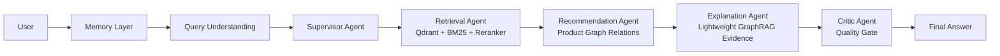

# AssistGen

**AssistGen** is a compact multi-agent ecommerce shopping assistant. It is designed as a learning and portfolio project for agentic application development: product retrieval, graph-based recommendations, explanation generation, memory management, quality control, and observable agent execution.

[中文说明](./README.zh-CN.md) | [Architecture](./docs/architecture.md) | [Memory Design](./docs/v3_memory_architecture.md) | [MIT License](./LICENSE)

## Why AssistGen

Most shopping bots stop at FAQ-style answers. AssistGen focuses on the complete shopping guidance loop:

- understand the user's intent, budget, preferences, and conversation context
- retrieve grounded product facts from hybrid RAG
- recommend related products through product-graph relations
- explain recommendations in a buyer-friendly way
- review the final answer with a Critic gate before responding
- stream agent progress to the frontend for observability and learning

## Architecture



## Key Features

- **Multi-agent orchestration**: Supervisor, Retrieval, Recommendation, Explanation, and Critic.
- **Hybrid retrieval**: Qdrant dense retrieval, BM25 sparse retrieval, metadata filtering, score fusion, and optional `gte-rerank-v2`.
- **Graph-based recommendation**: product relation data such as `COMPLEMENTS`, `BOUGHT_WITH`, `UPGRADE`, `BUNDLE`, and `SUBSTITUTE`.
- **Lightweight GraphRAG explanation**: relation evidence is retrieved and used to produce human-readable recommendation reasons.
- **Memory and context management**: session memory, `shopping_state`, `effective_query`, per-agent memory views, and compression for longer conversations.
- **Critic quality gate**: checks factual grounding, budget constraints, recommendation timing, formatting, and tone.
- **Observability**: backend Agent Trace Console and frontend SSE stage streaming.
- **Offline-friendly fallbacks**: the app can still run with local CSV data and in-memory session storage when Qdrant, Redis, Neo4j, or external APIs are unavailable.

## Tech Stack

| Area | Stack |
|---|---|
| Backend | Python, FastAPI, Pydantic |
| Agent Runtime | LangGraph-style agent pipeline |
| Frontend | Vue 3, Vite, TypeScript, Pinia |
| Retrieval | Qdrant, BM25, optional external reranker |
| Graph / Recommendation | CSV product graph, optional Neo4j fallback |
| Memory | Redis with in-memory fallback |
| LLM / Embedding | DeepSeek-compatible chat API, DashScope `text-embedding-v4`, `gte-rerank-v2` |

## Repository Structure

```text
AssistGen/
├── backend/                  # FastAPI backend and agent pipeline
│   ├── requirements.txt
│   └── llm_backend/
│       ├── app/
│       │   ├── api/          # HTTP and SSE APIs
│       │   ├── core/         # configuration, database, logging
│       │   ├── data/         # demo ecommerce product data
│       │   └── lg_agent/     # multi-agent core
│       ├── scripts/          # indexing, verification, and test scripts
│       └── run.py
├── frontend/                 # Vue 3 frontend
├── docs/                     # architecture, memory design, progress notes
├── scripts/                  # local infrastructure helpers
├── docker-compose.yml        # optional infrastructure setup
└── README.md
```

## Quick Start

### 1. Backend

```bash
cd backend/llm_backend
python -m venv .venv
.venv/Scripts/activate
pip install -r ../requirements.txt
copy .env.example .env
python run.py
```

Backend default URL:

```text
http://localhost:8000
```

Main Agent endpoints:

```text
POST /api/agent/query
POST /api/agent/query/stream
```

### 2. Frontend

```bash
cd frontend
npm install
npm run dev
```

Frontend default URL:

```text
http://localhost:5173
```

### 3. Optional Qdrant Indexing

If Qdrant is running locally:

```bash
cd backend/llm_backend
python scripts/index_products_to_qdrant.py
python scripts/index_explanation_evidence_to_qdrant.py
```

If Qdrant is not available, AssistGen falls back to local retrieval paths where possible.

## Environment Variables

Copy the example file:

```bash
cd backend/llm_backend
copy .env.example .env
```

Important variables:

| Variable | Description |
|---|---|
| `AGENT_SERVICE` | `deepseek` or `ollama` |
| `DEEPSEEK_API_KEY` | Chat model API key |
| `DEEPSEEK_BASE_URL` | DeepSeek-compatible API base URL |
| `DEEPSEEK_MODEL` | Chat model name |
| `EMBEDDING_PROVIDER` | `local` or `dashscope` |
| `EMBEDDING_MODEL` | default: `text-embedding-v4` |
| `EMBEDDING_API_KEY` | embedding API key when using DashScope |
| `RERANKER_PROVIDER` | set to `dashscope` to enable external reranking |
| `RERANKER_MODEL` | default: `gte-rerank-v2` |
| `QDRANT_URL` | Qdrant endpoint |
| `REDIS_HOST` / `REDIS_PORT` | optional memory store |
| `AGENT_TRACE` | set `true` to print compact agent trace logs |

Do not commit real API keys, database passwords, or local `.env` files.

## Development Checks

```bash
cd backend/llm_backend
python -B test_memory_context.py
python -B test_critic_quality_gate.py

cd ../../frontend
npm run build
```

## Roadmap

- Expand the smart-home ecommerce demo dataset.
- Improve graph recommendation evaluation and counterexample tests.
- Strengthen memory compression and per-agent context injection.
- Add cleaner deployment profiles for Docker-based Qdrant, Redis, and Neo4j.
- Polish the frontend observability panel for learning and demos.

## Project Status

AssistGen is an active learning project. The current version focuses on a small but complete agentic ecommerce guidance loop rather than a production-scale commerce platform.

## License

MIT License.
