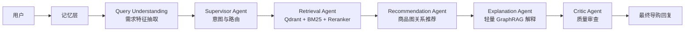

# AssistGen

**AssistGen** 是一个小而精的多智能体电商导购项目。它不是普通 FAQ 客服，而是围绕真实导购链路设计：理解需求、检索商品、生成搭配推荐、解释推荐理由、管理上下文，并用 Critic Agent 对最终回复做质量检查。

[English](./README.md) | [架构文档](./docs/architecture.md) | [记忆层设计](./docs/v3_memory_architecture.md) | [MIT License](./LICENSE)

## 项目定位

这个项目的目标不是堆技术栈，而是把 Agent 项目里真正有价值的部分做完整：

- 用户意图、预算、偏好、情绪和上下文理解
- 商品事实检索，避免模型凭空编商品
- 基于商品关系的搭配推荐，比如门锁搭配摄像头、扫地机器人搭配耗材
- 用 GraphRAG 风格的证据解释推荐理由
- 用 Critic Agent 检查预算、事实、人性化表达和过度推销问题
- 在前端和终端展示 Agent 执行过程，方便学习和面试讲解

## Agent 架构



## 核心能力

- **多智能体编排**：Supervisor、Retrieval、Recommendation、Explanation、Critic 分工明确。
- **完整检索链路**：Qdrant 向量检索、BM25 稀疏检索、元数据过滤、分数融合、可选 `gte-rerank-v2` 重排。
- **图关系推荐**：使用 `COMPLEMENTS`、`BOUGHT_WITH`、`UPGRADE`、`BUNDLE`、`SUBSTITUTE` 等商品关系生成搭配候选。
- **轻量 GraphRAG 解释**：从关系证据中检索依据，生成更像导购的推荐解释。
- **记忆与上下文管理**：支持 `session_id`、`shopping_state`、`effective_query`、每个 Agent 独立记忆视角和长会话压缩。
- **Critic 质量门控**：检查事实准确性、预算约束、推荐时机、格式可读性和回复语气。
- **可观测性**：后端 Agent Trace Console + 前端 SSE 阶段流式展示。
- **可降级运行**：Qdrant、Redis、Neo4j、外部 reranker 不可用时，仍能通过本地 CSV 和内存存储完成基础演示。

## 技术栈

| 模块 | 技术 |
|---|---|
| 后端 | Python, FastAPI, Pydantic |
| Agent | LangGraph 风格的多 Agent Pipeline |
| 前端 | Vue 3, Vite, TypeScript, Pinia |
| 检索 | Qdrant, BM25, 可选外部 Reranker |
| 推荐 | CSV 商品关系图，可选 Neo4j fallback |
| 记忆 | Redis，自动降级到 InMemory |
| 模型 | DeepSeek 兼容对话 API，DashScope `text-embedding-v4`，`gte-rerank-v2` |

## 目录结构

```text
AssistGen/
├── backend/                  # FastAPI 后端和 Agent Pipeline
│   ├── requirements.txt
│   └── llm_backend/
│       ├── app/
│       │   ├── api/          # HTTP / SSE 接口
│       │   ├── core/         # 配置、数据库、日志
│       │   ├── data/         # 演示用电商商品数据
│       │   └── lg_agent/     # 多智能体核心代码
│       ├── scripts/          # 数据索引、验证、压测脚本
│       └── run.py
├── frontend/                 # Vue 3 前端
├── docs/                     # 架构、记忆层、进度文档
├── scripts/                  # 本地基础设施脚本
├── docker-compose.yml        # 可选 Docker 基础设施
└── README.md
```

## 快速启动

### 1. 启动后端

```bash
cd backend/llm_backend
python -m venv .venv
.venv/Scripts/activate
pip install -r ../requirements.txt
copy .env.example .env
python run.py
```

后端默认地址：

```text
http://localhost:8000
```

核心接口：

```text
POST /api/agent/query
POST /api/agent/query/stream
```

### 2. 启动前端

```bash
cd frontend
npm install
npm run dev
```

前端默认地址：

```text
http://localhost:5173
```

### 3. 可选：构建 Qdrant 索引

如果本机已经启动 Qdrant：

```bash
cd backend/llm_backend
python scripts/index_products_to_qdrant.py
python scripts/index_explanation_evidence_to_qdrant.py
```

如果 Qdrant 暂时不可用，项目会尽量走本地降级链路，方便开发演示。

## 环境变量

复制环境变量模板：

```bash
cd backend/llm_backend
copy .env.example .env
```

常用配置：

| 变量 | 说明 |
|---|---|
| `AGENT_SERVICE` | `deepseek` 或 `ollama` |
| `DEEPSEEK_API_KEY` | 对话模型 API Key |
| `DEEPSEEK_BASE_URL` | DeepSeek 兼容接口地址 |
| `DEEPSEEK_MODEL` | 对话模型名称 |
| `EMBEDDING_PROVIDER` | `local` 或 `dashscope` |
| `EMBEDDING_MODEL` | 默认 `text-embedding-v4` |
| `EMBEDDING_API_KEY` | 使用 DashScope embedding 时填写 |
| `RERANKER_PROVIDER` | 设置为 `dashscope` 后启用外部重排 |
| `RERANKER_MODEL` | 默认 `gte-rerank-v2` |
| `QDRANT_URL` | Qdrant 地址 |
| `REDIS_HOST` / `REDIS_PORT` | 可选记忆存储 |
| `AGENT_TRACE` | 设置为 `true` 后在终端打印 Agent Trace |

不要提交真实 API Key、数据库密码或本地 `.env` 文件。

## 开发检查

```bash
cd backend/llm_backend
python -B test_memory_context.py
python -B test_critic_quality_gate.py

cd ../../frontend
npm run build
```

## 后续规划

- 扩充智能家居电商演示数据。
- 增加图推荐的评估样例和反例测试。
- 继续完善记忆压缩和每个 Agent 的选择性上下文注入。
- 补齐 Docker 化的 Qdrant、Redis、Neo4j 开发环境。
- 打磨前端 Agent 过程展示，让项目更适合学习和面试演示。

## 当前状态

AssistGen 仍是持续迭代中的学习项目。当前重点是打通一个小而完整的 Agentic Ecommerce Guidance Loop，而不是做成生产级电商平台。

## License

MIT License。
