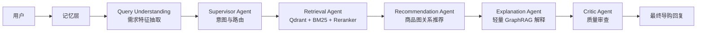

# AssistGen

<p align="center">
  
  
  
  
  
</p>

<p align="center">
  <b>[ <a href="./README.md">English</a> | 中文说明 ]</b>
</p>

**AssistGen** 是一个小而精的多智能体电商导购项目。它不是普通 FAQ 客服，而是围绕真实导购链路设计：理解需求、检索商品、生成搭配推荐、解释推荐理由、管理上下文，并用 Critic Agent 对最终回复做质量检查。

这个项目的定位是 Agent 开发学习与求职作品集项目，重点展示清晰的 Agent 架构、可观测执行过程和电商导购场景下的实用推理，而不是做一个泛泛的聊天机器人 Demo。

## 核心特性

- **多智能体导购链路**：Supervisor、Retrieval、Recommendation、Explanation、Critic 分工明确，围绕真实购物决策流转。
- **完整检索增强链路**：Qdrant 向量检索、BM25 稀疏检索、元数据过滤、分数融合、可选 `gte-rerank-v2` 重排。
- **商品图关系推荐**：基于 `COMPLEMENTS`、`BOUGHT_WITH`、`UPGRADE`、`BUNDLE`、`SUBSTITUTE` 等关系生成搭配候选。
- **轻量 GraphRAG 解释**：从商品关系证据中检索依据，生成更像导购的推荐解释，但不让 LLM 编造商品。
- **记忆与上下文管理**：支持 `session_id`、`shopping_state`、`effective_query`、每个 Agent 独立记忆视角和长会话压缩。
- **Critic 质量门控**：检查事实准确性、预算约束、推荐时机、格式可读性和回复语气。
- **可观测运行过程**：支持后端 Agent Trace Console 和前端 SSE 阶段流式展示，方便学习、调试和面试演示。
- **可降级运行**：Qdrant、Redis、Neo4j、外部 reranker 不可用时，仍能通过本地 CSV 和内存存储完成基础演示。

## Agent 架构



## 技术栈

| 模块 | 技术 |
|---|---|
| 后端 | Python, FastAPI, Pydantic |
| Agent | LangGraph 风格的多 Agent Pipeline |
| 前端 | Vue 3, Vite, TypeScript, Pinia |
| 检索 | Qdrant, BM25, 可选外部 Reranker |
| 推荐 | CSV 商品关系图，可选 Neo4j fallback |
| 记忆 | Redis，自动降级到 InMemory |
| 模型 | DeepSeek 兼容对话 API，DashScope `text-embedding-v4`，`gte-rerank-v2` |

## 快速开始

### 1. 获取项目

```bash
git clone https://github.com/lgh88666/lgh88666-assistgen.git
cd lgh88666-assistgen
```

### 2. 启动后端

要求 Python 3.10+。

```bash
cd backend/llm_backend
python -m venv .venv
.venv/Scripts/activate
pip install -r ../requirements.txt
copy .env.example .env
python run.py
```

后端默认地址：

```text
http://localhost:8000
```

核心接口：

```text
POST /api/agent/query
POST /api/agent/query/stream
```

### 3. 启动前端

```bash
cd frontend
npm install
npm run dev
```

前端默认地址：

```text
http://localhost:5173
```

### 4. 可选：构建 Qdrant 索引

如果本机已经启动 Qdrant：

```bash
cd backend/llm_backend
python scripts/index_products_to_qdrant.py
python scripts/index_explanation_evidence_to_qdrant.py
```

如果 Qdrant 暂时不可用，项目会尽量走本地降级链路，方便开发演示。

## 数据结构

项目内置一份模拟的智能家居电商数据，用于 Demo 和测试。

```text
backend/llm_backend/app/data/
├── products.csv              # 商品事实：价格、库存、品牌、类目、标签
└── product_relations.csv     # 商品关系：搭配、升级、套装、替代
```

## 环境变量

复制环境变量模板：

```bash
cd backend/llm_backend
copy .env.example .env
```

常用配置：

| 变量 | 说明 |
|---|---|
| `AGENT_SERVICE` | `deepseek` 或 `ollama` |
| `DEEPSEEK_API_KEY` | 对话模型 API Key |
| `DEEPSEEK_BASE_URL` | DeepSeek 兼容接口地址 |
| `DEEPSEEK_MODEL` | 对话模型名称 |
| `EMBEDDING_PROVIDER` | `local` 或 `dashscope` |
| `EMBEDDING_MODEL` | 默认 `text-embedding-v4` |
| `EMBEDDING_API_KEY` | 使用 DashScope embedding 时填写 |
| `RERANKER_PROVIDER` | 设置为 `dashscope` 后启用外部重排 |
| `RERANKER_MODEL` | 默认 `gte-rerank-v2` |
| `QDRANT_URL` | Qdrant 地址 |
| `REDIS_HOST` / `REDIS_PORT` | 可选记忆存储 |
| `AGENT_TRACE` | 设置为 `true` 后在终端打印 Agent Trace |

不要提交真实 API Key、数据库密码或本地 `.env` 文件。

## 目录结构

```text
AssistGen/
├── backend/
│   ├── requirements.txt
│   └── llm_backend/
│       ├── app/
│       │   ├── api/
│       │   ├── core/
│       │   ├── data/
│       │   └── lg_agent/
│       ├── scripts/
│       └── run.py
├── frontend/
├── docs/
├── scripts/
├── docker-compose.yml
└── README.md
```

## 开发检查

```bash
cd backend/llm_backend
python -B test_memory_context.py
python -B test_critic_quality_gate.py

cd ../../frontend
npm run build
```

## 后续规划

- 扩充智能家居电商演示数据。
- 增加图推荐的评估样例和反例测试。
- 继续完善记忆压缩和每个 Agent 的选择性上下文注入。
- 补齐 Docker 化的 Qdrant、Redis、Neo4j 开发环境。
- 打磨前端 Agent 过程展示，让项目更适合学习和面试演示。

## 更多文档

- [Architecture](./docs/architecture.md)
- [Memory Design](./docs/v3_memory_architecture.md)
- [Draw.io Architecture Diagram](./docs/assistgen_architecture.drawio)

## License

AssistGen 使用 [MIT License](./LICENSE) 开源。
